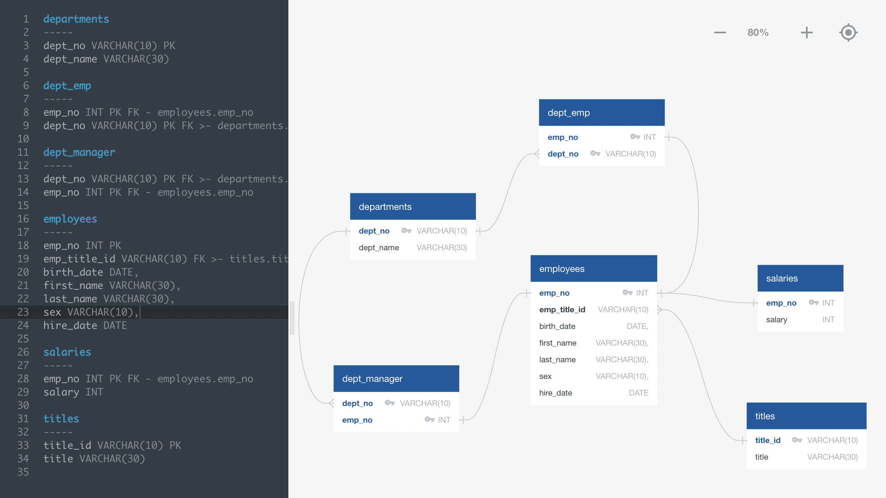
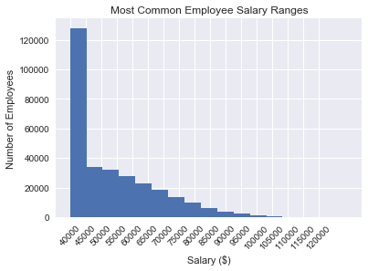
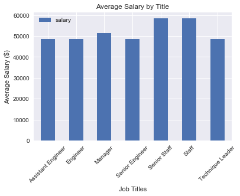

### Employee-Database
#### <i> Design, implementation, and analysis of an SQL database.</i>

----------------------

**Description:**

I used Postgres SQL to create a database from 6 related CSVs. Using this database I investigated some mysterious data.

<b>Datasets used:</b>

* [Departments](EmployeeSQL/data/departments.csv)
* [Department Employees](EmployeeSQL/data/dept_emp.csv)
* [Department Managers](EmployeeSQL/data/dept_managers.csv)
* [Employees](EmployeeSQL/data/employees.csv)
* [Salaries](EmployeeSQL/data/salaries.csv)
* [Titles](EmployeeSQL/data/titles.csv)

### Tools used:
----------------------

  - Postgres
  - SQL
  - ERD
  - Jupyter
  - Python
  - Matplotlib
  - SQL Alchemy

### Database Construction:
----------------------

#### ERD

### Analysis:
----------------------

#### Common Salary Ranges

#### Average Salary by Title
